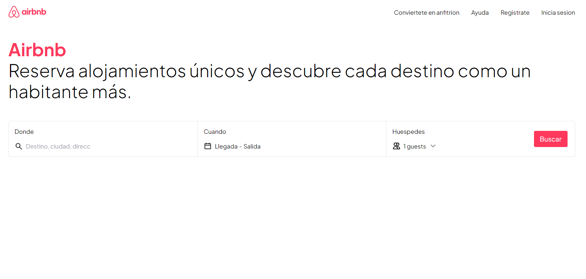

<h1 align="center">Welcome to Airbnb Clone 👋</h1>
<p>
  
  <a href="https://twitter.com/albertocruzdev" target="_blank">
    
  </a>
</p>

> Airbnb Clone

<a href="https://airbnbclonetbd.vercel.app" target="_blank">
    
</a>

### ✨ [Demo](https://airbnbclonetbd.vercel.app)

## Install

```sh
npm install
```

## Usage

```sh
npm run start
```

## Run tests

```sh
npm run test
```

## Author

👤 **Alberto Cruz Luis**

* Website: albertocruzluis.com
* Twitter: [@albertocruzdev](https://twitter.com/albertocruzdev)
* Github: [@AlbertoCruzLuis](https://github.com/AlbertoCruzLuis)
* LinkedIn: [@albertocruzluis](https://linkedin.com/in/albertocruzluis)

## Show your support

Give a ⭐️ if this project helped you!

***
_This README was generated with ❤️ by [readme-md-generator](https://github.com/kefranabg/readme-md-generator)_